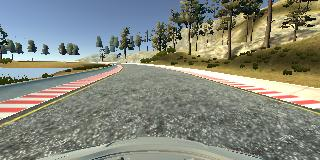
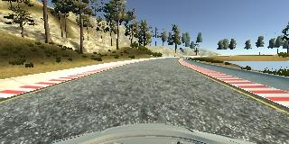
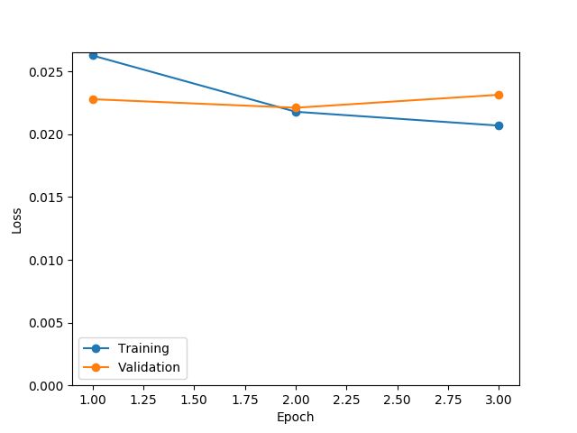
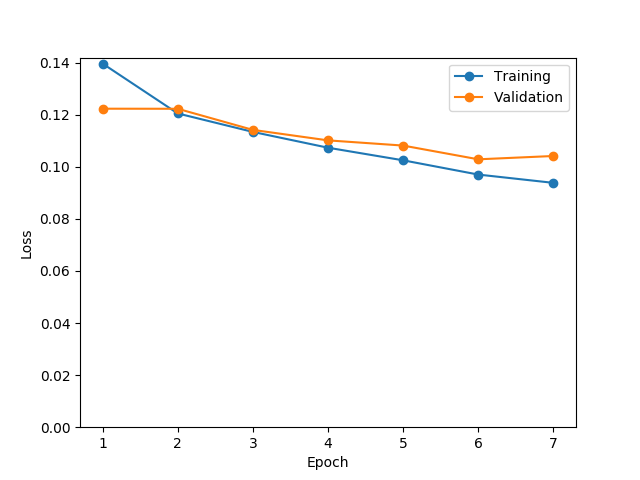

# **Behavioral Cloning**

---

**Behavioral Cloning Project**

The goals / steps of this project are the following:
* Use the simulator to collect data of good driving behavior
* Build, a convolution neural network in Keras that predicts steering angles from images
* Train and validate the model with a training and validation set
* Test that the model successfully drives around track one without leaving the road
* Summarize the results with a written report

## Rubric Points
### Here I will consider the [rubric points](https://review.udacity.com/#!/rubrics/432/view) individually and describe how I addressed each point in my implementation.  

---
### Model Architecture and Training Strategy

#### 1. An appropriate model architecture has been employed

My model is as bellow.

| Layer           | Description
|:----------------|:-----------
| Input           | 3@100x200 YUV image
| Normalization   |
| Cropping        | 3@66x200
| Convolution 5x5 | 24@30x98 (stride: 2x2; padding: VALID; activation: LeakyReLU)
| Convolution 5x5 | 36@14x47 (stride: 2x2; padding: VALID; activation: LeakyReLU)
| Convolution 5x5 | 48@5x22  (stride: 2x2; padding: VALID; activation: LeakyReLU)
| Convolution 3x3 | 64@3x20  (stride: 1x1; padding: VALID; activation: LeakyReLU)
| Convolution 3x3 | 64@1x18  (stride: 1x1; padding: VALID; activation: LeakyReLU)
| Dropout         | keep_prob: 0.5
| Flatten         | 1164
| Fully-connected | 100
| Fully-connected | 50
| Fully-connected | 10
| Fully-connected | 1

#### 2. Attempts to reduce overfitting in the model

- The model contains dropout layers in order to reduce overfitting ([model.py lines 33](https://github.com/eduidl/CarND-Behavioral-Cloning-P3/blob/master/model.py#L33)).
- The model was trained and validated on different data sets to ensure that the model was not overfitting ([model.py lines 103-105](https://github.com/eduidl/CarND-Behavioral-Cloning-P3/blob/master/model.py#L103-L105)).
- Early stopping is employed ([model.py lines 107](https://github.com/eduidl/CarND-Behavioral-Cloning-P3/blob/master/model.py#L107)).
- The model was tested by running it through the simulator and ensuring that the vehicle could stay on the track.

#### 3. Model parameter tuning

The model used an adam optimizer, so the learning rate was not tuned manually ([model.py lines 111](https://github.com/eduidl/CarND-Behavioral-Cloning-P3/blob/master/model.py#L111)).

#### 4. Appropriate training data

Training data was chosen to keep the vehicle driving on the road. I used a combination of center lane driving, recovering from the left and right sides of the road. For details about how I created the training data, see the next section.

### Model Architecture and Training Strategy

#### 1. Solution Design Approach

The overall strategy for deriving a model architecture was to extract feature such as lane edge and predict steering angle.

My first step was to use a convolution neural network model similar to the image classification. I thought this model might be appropriate because using comvolution layers is enable to extract edge feature.

In order to gauge how well the model was working, I split my image and steering angle data into a training and validation set. I found that my first model had a low mean squared error on the training set but a high mean squared error on the validation set. This implied that the model was overfitting.

To combat the overfitting, I modified the model as follows.

- Introduction of dropout layer
- Data augmentation
  - Not only images from center camera, but also from left or right camera are employed.
  - Horizontally flipped images are employed.
- Early stooping

The final step was to run the simulator to see how well the car was driving around track one. There were a few spots where the vehicle fell off the track... to improve the driving behavior in these cases, I used histogram equalization as preprocessing. Besiedes, I added some data on difficult situation (on bridge and near artificial obstacles)

At the end of the process, the vehicle is able to drive autonomously around the track without leaving the road.

#### 2. Final Model Architecture

The final model has been described in [above section](#1-an-appropriate-model-architecture-has-been-employed).

#### 3. Creation of the Training Set & Training Process

##### Track 1

To capture good driving behavior, I first recorded two laps on track one using center lane driving. Here is an example image of center lane driving:

I then recorded a bit rough driving including vehicle recovering from the left side and right sides of the road back to center so that the vehicle would be able to so.

And, I recorded driving similarly in the reverse direction.

To augment the data set, I also flipped images and angles thinking that this would equalize number of left curve and of right curve. For example, here is an image that has then been flipped:

I finally randomly shuffled the data set and put 20% of the data into a validation set.

I used this training data for training the model. The validation set helped determine if the model was over or under fitting. I used an adam optimizer so that manually training the learning rate wasn't necessary.

Here is plot of loss and validation loss.

 

##### Track 2

I tackled the task about track 2 in the same way as track 1.
Driving using simulator on track 2 is very hard task, and I could only drive on the center line. Therefore, second model ([model_track2.h5](https://github.com/eduidl/CarND-Behavioral-Cloning-P3/blob/master/model_track2.h5)) tends to drive car on center line, and cannot drive car successfully on track 1.

I wanted to create model which can be applyed to track 1 and track 2, however I could not.

Here is plot of loss and validation loss.

 

### Result (video)

- [Track 1](https://github.com/eduidl/CarND-Behavioral-Cloning-P3/blob/master/track1.mp4)
- [Track 2](https://github.com/eduidl/CarND-Behavioral-Cloning-P3/blob/master/track2.mp4)
