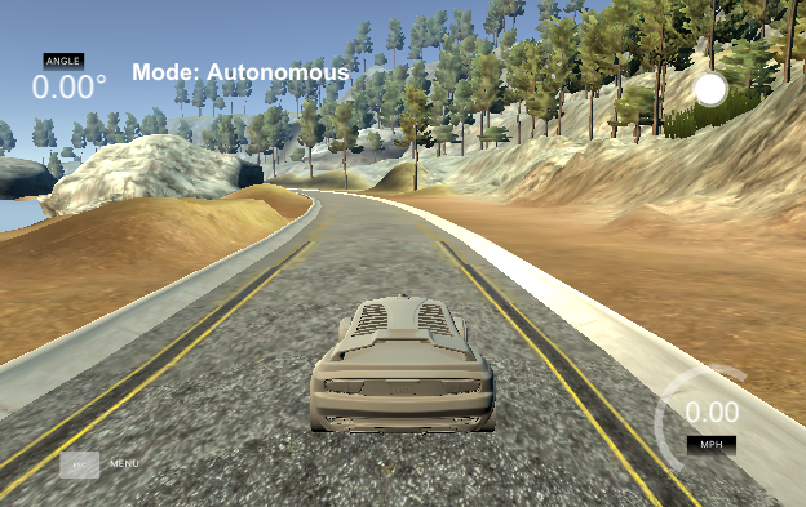
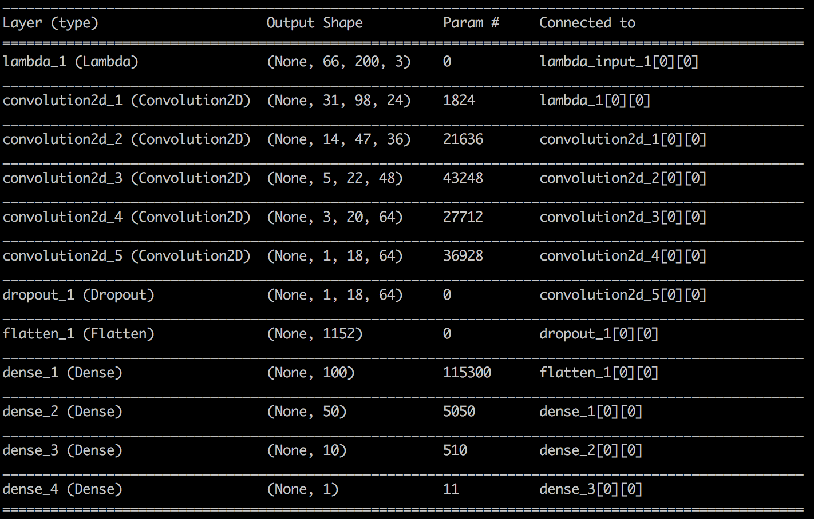
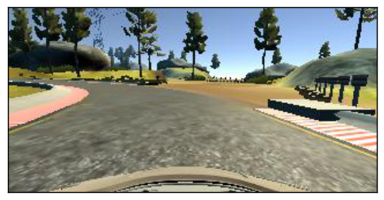
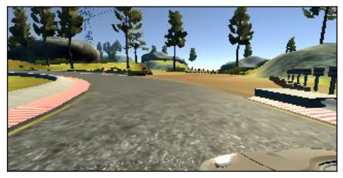
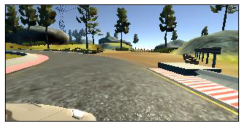
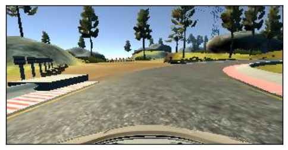
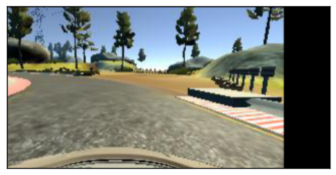
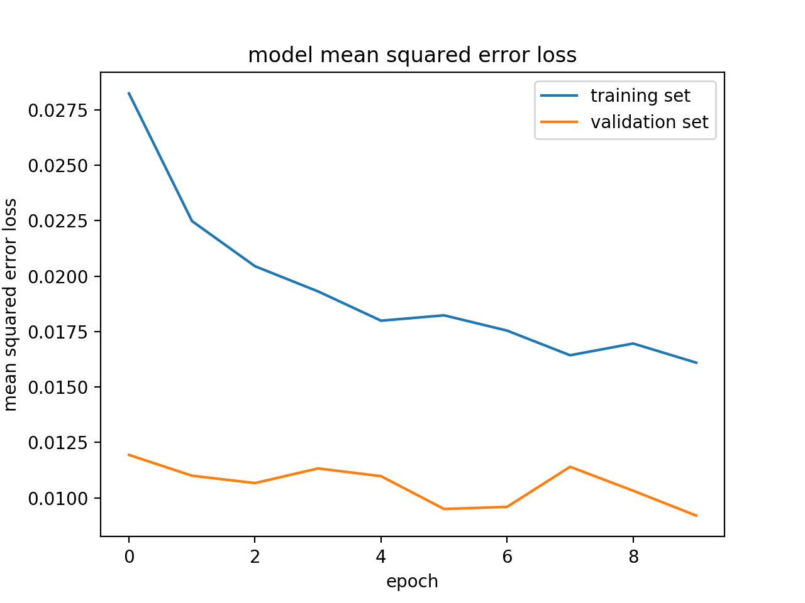

# Behavioral Cloning

---

|Lake Track|
|:--------:|
|[](https://youtu.be/DhLJaF0NYY4)|
|[YouTube Link](https://youtu.be/DhLJaF0NYY4)|

**Behavioral Cloning Project**

The goals / steps of this project are the following:
* Use the simulator to collect data of good driving behavior
* Build, a convolution neural network in Keras that predicts steering angles from images
* Train and validate the model with a training and validation set
* Test that the model successfully drives around track one without leaving the road
* Summarize the results with a written report

## Rubric Points
###Here I will consider the [rubric points](https://review.udacity.com/#!/rubrics/432/view) individually and describe how I addressed each point in my implementation.  

---
### Files Submitted & Code Quality

#### Submission includes all required files and can be used to run the simulator in autonomous mode

My project includes the following files:
* model.py containing the script to create and train the model
* drive.py for driving the car in autonomous mode
* model.h5 containing a trained convolution neural network 
* writeup_report.md or writeup_report.pdf summarizing the results

#### Submission includes functional code
Using the Udacity provided simulator and my drive.py file, the car can be driven autonomously around the track by executing 
```sh
python drive.py model.h5
```

#### Submission code is usable and readable

The model.py file contains the code for training and saving the convolution neural network. The file shows the pipeline I used for training and validating the model, and it contains comments to explain how the code works.

The utils.py file contains the code for helper which include augment, preprocess and generator.

### Model Architecture and Training Strategy

#### An appropriate model architecture has been employed

My model adopted NVIDIA architecture which consists of five convolution layers (three 5x5 filter and the other 3*3 filter) and four dense layers. I used lambda layer to normalized input images to make gradients work well. And also I included RELU layers to introduce nonlinearity.

#### Attempts to reduce overfitting in the model

The model contains dropout layers in order to reduce overfitting.

The model was add some augmented data randomly to ensure that the model was not overfitting. The model was tested by running it through the simulator and ensuring that the vehicle could stay on the track.

#### Model parameter tuning

The model used an adam optimizer whth the learning rate of 1.0e-4 which is smaller than the default value of 1.0e-3. Because it can prevent the loss stop improving too soon.

#### Appropriate training data

I just used the sample data for training.

### Model Architecture and Training Strategy

#### Solution Design Approach

I used a convolution neural network model similar to the NVIDIA. I thought this model might be appropriate because it has been verified.

In order to gauge how well the model was working, I split my image and steering angle data into a training and validation set. I found that my first model had both low mean squared error on the training set and the validation set. But it can't work well in the autonomous mode. The car fell off the track frequently. I found the cropped part of image was too big. So I adjusted the size of cropping. At the end of the process, the vehicle is able to drive autonomously around the track without leaving the road.

#### Final Model Architecture

Here is a visualization of the architecture (note: visualizing the architecture is optional according to the project rubric)



#### Samples of augmented images

The following is the sample transformations:

**Center Image**


**Left Image**


**Right Image**


**Flipped Image**


**Translated Image**



#### Error Loss
